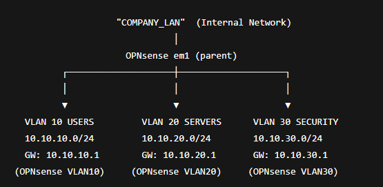

# SIEM + IDS/IPS Lab — OPNsense + Wazuh + Suricata (VirtualBox)

A hands-on, multi-VM **cybersecurity lab** that simulates a small company network and demonstrates an end-to-end detection pipeline:

- **OPNsense** as firewall/router + **central log source**
- **Suricata** for **IDS/IPS** visibility (and optional blocking)
- **Wazuh** as **SIEM** (manager + dashboard) aggregating logs from endpoints + firewall
- **Kali** attacker VM used to generate realistic traffic and validate detections

> Portfolio focus: building a realistic lab, collecting evidence, and documenting incident-style scenarios (attack → detection → investigation).

---

## What this project demonstrates

### ✅ Centralized logging (SIEM)
- Windows endpoint logs via **Wazuh agent**
- Linux endpoint logs via **Wazuh agent**
- OPNsense **firewall logs (filterlog)** via **syslog**
- Suricata events via **syslog / IDS logs**

### ✅ Detection & alerting
- Custom Wazuh rules to raise alerts from OPNsense syslog streams (stored in `rules/` / `configs/`)
- Visibility in `wazuh-alerts-*` and investigation in the dashboard (Discover / Security events)

### ✅ IDS/IPS visibility (Suricata)
- ET Open (or equivalent) rulesets
- Alerts generated from port scans / probing traffic
- Optional IPS mode to demonstrate “detect vs block” in a controlled lab

---

## Lab architecture (high level)

**VirtualBox** lab network with:
- **OPNsense** as the gateway/firewall for the internal company LAN
- Internal systems:
  - `APP-SRV` (target server)
  - `SEC-SRV` (Wazuh server)
  - `WIN-CLIENT` (Windows endpoint)
  - `LINUX-CLIENT` (Linux endpoint)
  - `KALI-ATTACKER` (attacker simulation)

📌 See full details here: **[`docs/architecture.md`](docs/architecture.md)**  

---

## Tools & technologies
- **OPNsense** (routing, firewall rules, DHCP, remote syslog targets)
- **Suricata** (IDS/IPS in OPNsense)
- **Wazuh** (SIEM manager + dashboard)
- **Windows Event Logs** (via agent)
- **Linux auth/syslog** (via agent)
- **Kali Linux** (traffic generation: scans / brute-force simulation)

---

## Evidence (screenshots & proof)
This repo is intentionally documentation-heavy (portfolio style).

- ✅ Curated evidence list: **[`docs/evidence.md`](docs/evidence.md)**

Tip: Prefer a small set of high-signal screenshots over a large gallery:
- network diagram
- OPNsense syslog target
- Suricata alerts page
- Wazuh agents list
- Wazuh alert/event view for a scenario
- IPS blocking evidence

---

## Incident scenarios (documented)
These are written like mini incident reports: **attack → logs → detection → what it means**.

- **Scenario 1 — SSH brute-force attempt**
  - Attacker attempts multiple SSH logins on `APP-SRV`
  - Suricata + firewall logs + Wazuh correlate the activity  
  - File: `docs/scenario1_ssh_bruteforce.md`

- **Scenario 2 — Port scan + web probing**
  - Nmap scan + suspicious HTTP requests
  - Suricata detects recon / web anomalies  
  - File: `docs/scenario2_portscan_web.md`

---

## How to recreate (high-level)
This is a **high-level** guide (exact clicks/commands vary by versions).

1. Create VMs: OPNsense, SEC-SRV, APP-SRV, WIN-CLIENT, LINUX-CLIENT, KALI
2. Build internal LAN in VirtualBox and ensure all VMs can reach OPNsense
3. Configure:
   - OPNsense LAN + DHCP (for clients)
   - Static IPs for servers (SEC-SRV, APP-SRV)
4. Install Wazuh all-in-one on **SEC-SRV**
5. Install Wazuh agents on Windows + Linux endpoints
6. Configure OPNsense **Remote Logging (syslog)** → `SEC-SRV:514`
7. Enable Suricata + download rulesets + generate alerts
8. Run attacker simulations from Kali and validate detections in Wazuh

---

## Repository structure

.
├─ README.md
├─ docs/
│ ├─ architecture.md
│ ├─ evidence.md
│ ├─ scenario1_ssh_bruteforce.md
│ └─ scenario2_portscan_web.md
├─ configs/
│ ├─ opnsense/
│ └─ wazuh/
├─ rules/
│ └─ local_rules.xml
├─ diagrams/
│ └─ network_diagram.png
├─ screenshots/
└─ samples/

---

## Current status / known gaps
- Some custom rule tuning is still in progress .
- Next improvements are mostly documentation + rule quality (less noise, more precise matching).

---

## Resume / LinkedIn bullets
- Built a multi-VM SIEM + IDS/IPS lab in VirtualBox using OPNsense, Suricata, and Wazuh to centralize endpoint and network telemetry.
- Integrated Windows/Linux agents with OPNsense syslog to enable centralized investigation and alerting in Wazuh dashboards.
- Validated detections with controlled simulations (SSH failed logins, port scanning) and documented evidence for repeatable verification.

---

## Disclaimer
This repository is for **education and lab practice only**. All testing was performed in an isolated environment on systems I own .

